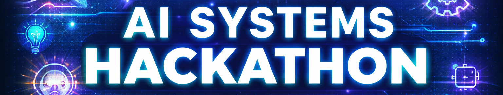

# 🎯 AI Systems Hackathon

- When: March 6–7, 2026
- Time: Starts Friday 3:30 PM → Ends Saturday 3:30 PM; Demo Session Saturday 2:30–3:30 PM
- Where: Upson Hall (room TBD)
- Who: Systems Engineering MEng / MS students OR SYSEN 5381 / SYSEN 5460 participants — up to 5 per team

---

### Quick Links

- [🗓️ Schedule of Events](docs/schedule.md)
- [💬 Prompts & Challenge Details (updated at kickoff)](docs/prompts.md)
- [🔢 Evaluation Criteria](docs/criteria.md)
- 📚 [Resources for Building Your Tool](docs/resources.md)
- [⁉️ Frequently Asked Questions](#-frequently-asked-questions)
- [👥 Signup for Hackathon](https://bit.ly/aisystemshackathon-signup)

---

### 💡 The Challenge

Over 24 hours, your team will build and deploy a new **AI-powered system** in response to one of three possible prompts.

- 🧩 3 prompts released at kickoff — pick one and design a tool around it
- 🤖 Incorporate **generative AI** (OpenAI or Ollama Cloud) into your solution
- 🧱 Build something functional and **demo-ready** — a REST API, Dashboard, or other deployable app
- 🎯 Meet a specific **stakeholder need** in response to your chosen prompt
- 🔢 Evaluation: All projects receive a score of 0 to 100. [Read the evaluation criteria here!](docs/criteria.md)
- 🏆 Top team wins a prize and bragging rights.

[Learn more about the challenge here!](docs/prompts.md)

---

### ⁉️ Frequently Asked Questions

- **Who can participate?** All Hackathon team members must be (1) on-campus, enrolled Cornell students and (2a) part of the Systems Engineering Masters of Engineering or MS program OR (2b) enrolled in SYSEN 5381 or SYSEN 5460.
  *E.g. Anna is in SYSEN 5381 and Daphne is a SYSEN MEng student.*

- **Do I need prior AI or coding experience?** No! We assume you are new to coding (e.g., learned within the last 2 months). Optional trainings will cover querying AI, building APIs, using Cursor IDE, Supabase, and deploying to Posit Connect. The goal is to show you what you can create on your own!

- **Do I have to be a coding wizard to participate?** No! As long as you have *some* prior coding experience in Python or R, you can use either language. A winning project is one that works, incorporates generative AI, and meets a stakeholder need — not necessarily the most complex code.

- **What if I can't find team members?** Sign up anyway! If you don't have a team, we will match you with team members.

- **Do I have to participate the whole 24 hours?** You do you. A successful team will work for most of the 24 hours.

- **Can I ever step out?** Yes, but please keep it to a minimum. Consider staggering breaks so someone is always with the project.

- **Can I sleep?** You do you. Your health matters. Consider staggering which team members take breaks.

- **Can we work from a coffeeshop?** Sure. You do you.

- **Can one of my team members not attend in person?** No. All team members must attend the Hackathon in person to compete.

- **What do I need to make?** Your team will demo a working, deployed AI-powered prototype at the end of the Hackathon (e.g., an app on Posit Connect, or a public API).

- **What software do I need?** Install R or Python and at least one coding environment (e.g. RStudio, VSCode, Cursor, Positron) **before** the event. We'll cover Cursor, OpenAI/Ollama, Supabase, APIs, and Posit Connect in optional trainings.

- **How do we share our final product?** On a public GitHub repository. At least one team member must have a GitHub account; publish your code to GitHub by the deadline for judge review.

- **What language should I use?** R, Python, or a combination. Code must be reproducible and shared on GitHub.

- **What skills are helpful?** Building functions in R/Python, using GitHub, querying APIs, querying generative AI, building a small API, building a Shiny or Python dashboard, using Cursor for AI-assisted coding.

- **How will projects be evaluated?** By (1) fit to the prompt, (2) quality of concept, (3) completeness of implementation including AI integration, and (4) polish. [Full criteria here.](docs/criteria.md)

---

### 👥 How to Join

Form a team (max 5 members) and sign up here: [https://bit.ly/aisystemshackathon-signup](https://bit.ly/aisystemshackathon-signup)

Don't have a team? Sign up anyway and we will match you with a team!

---

### 📚 Sign Up to Mentor

Faculty, postdocs, PhD students, and developers are encouraged to sign up to mentor. For details, see [docs/mentors.md](docs/mentors.md).

---

