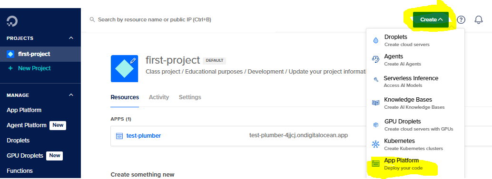
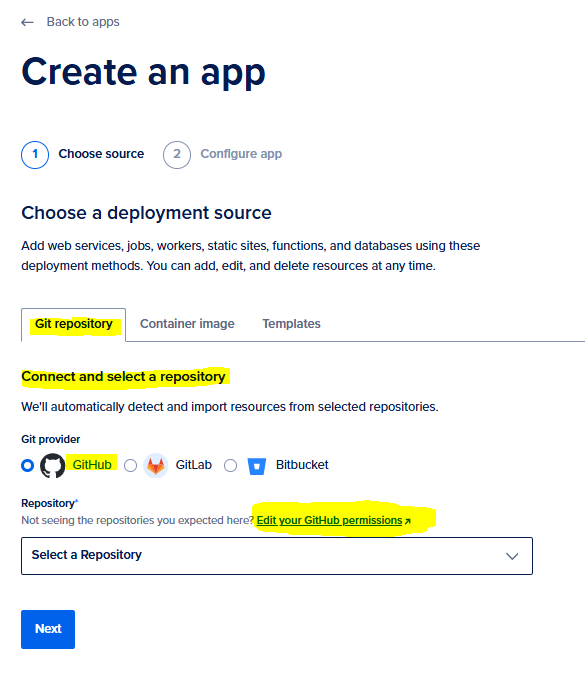
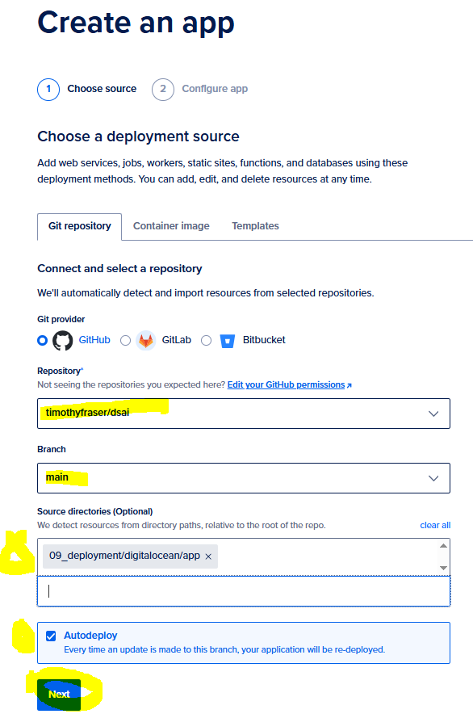

# 📌 ACTIVITY

## Create App Platform with DigitalOcean

🕒 *Estimated Time: 10 minutes*

---

## ✅ Your Task: Deploy a Live App with DigitalOcean's App Platform

In this task, you will deploy a live app with **DigitalOcean's App Platform**!

### 🧱 Create App Platform

- [ ] Go to your **DigitalOcean Project** main page.
- [ ] Select **Create** >> **App Platform** (marked in yellow in the image below). This will open the **Create App** menu.

### 🔗 Select Git Repository

- [ ] Select **Git repository**
- [ ] Select **Connect and select a repository**
- [ ] Under **Git provider**, select **GitHub** 
- [ ] Under **Repository**, click [**Edit your GitHub Permissions**](https://cloud.digitalocean.com/apps/github/install).

### 🔐 Authorize Specific Repository

- Here, we will login to **GitHub** and authorize **GitHub** to use the **DigitalOcean Integration** for specific repositories of yours, public or private.
- [ ] Navigate to **Repository Access**
- [ ] Select **Only select repositories**
- [ ] Click **Select repositories** dropdown menu.
- [ ] Select any repositories you need, e.g., your team project repository, a test repository, etc. **Select the repository that contains your app's code.**
- [ ] Click **Save**.

### ✅ Complete Git Repo Selection

- [ ] Back on the **Create an App** page, select the repository.
- [ ] Select the branch of the repo to deploy from. Typically `main`.
- [ ] If your code is in a folder, optionally enter the path to that folder.
- [ ] Select **Autodeploy** to deploy this code every time.
- [ ] Select **Next**.

### ✅ Review and configure settings

- [ ] Set the instance size to a low-cost tier.
- [ ] Use these demo folders as deployment sources:
  - [`../fastapi/`](../fastapi/) - Python FastAPI API
  - [`../plumber/`](../plumber/) - R Plumber API
  - [`../shinypy/`](../shinypy/) - Shiny for Python app
  - [`../shinyr/`](../shinyr/) - Shiny for R app
- [ ] For any app type, prefer **Dockerfile** strategy when a `Dockerfile` is present.
- [ ] Keep run/start commands aligned with each folder's README and test script.

---

---

← 🏠 [Back to Top](#ACTIVITY)
