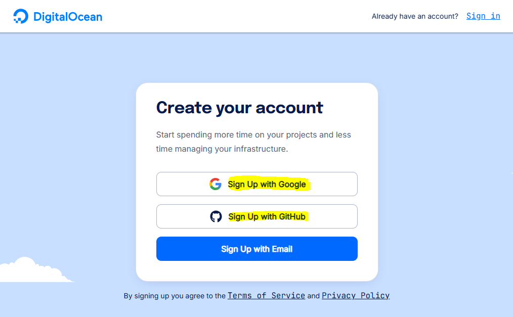
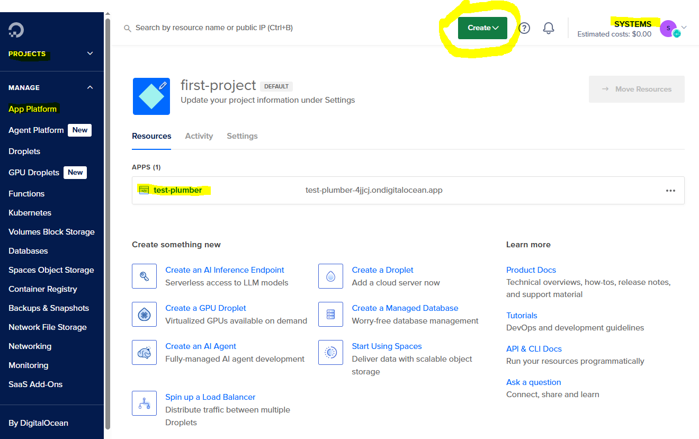
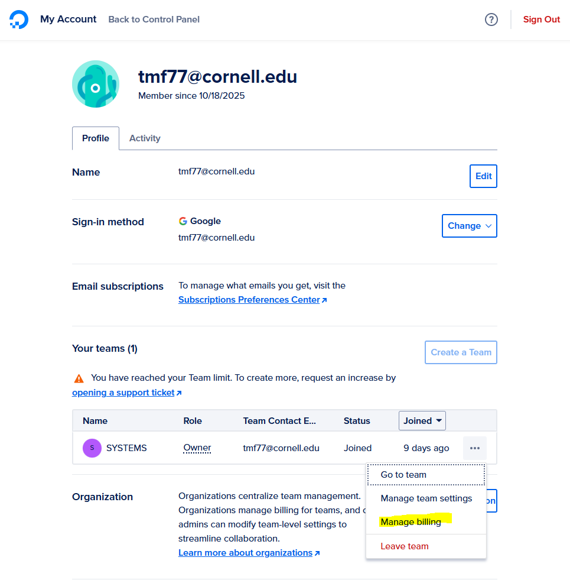
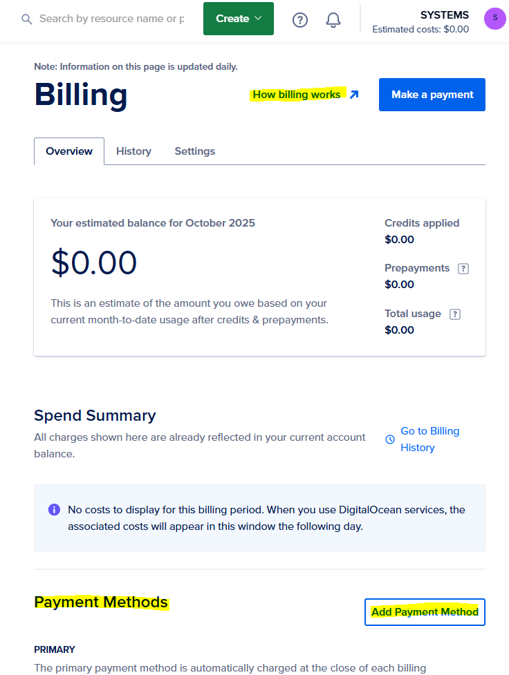
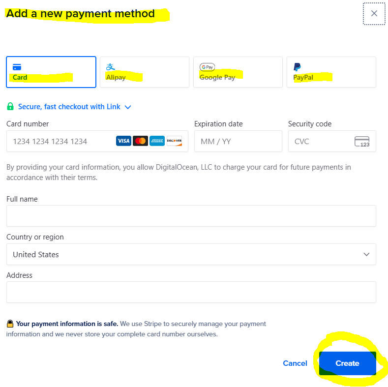
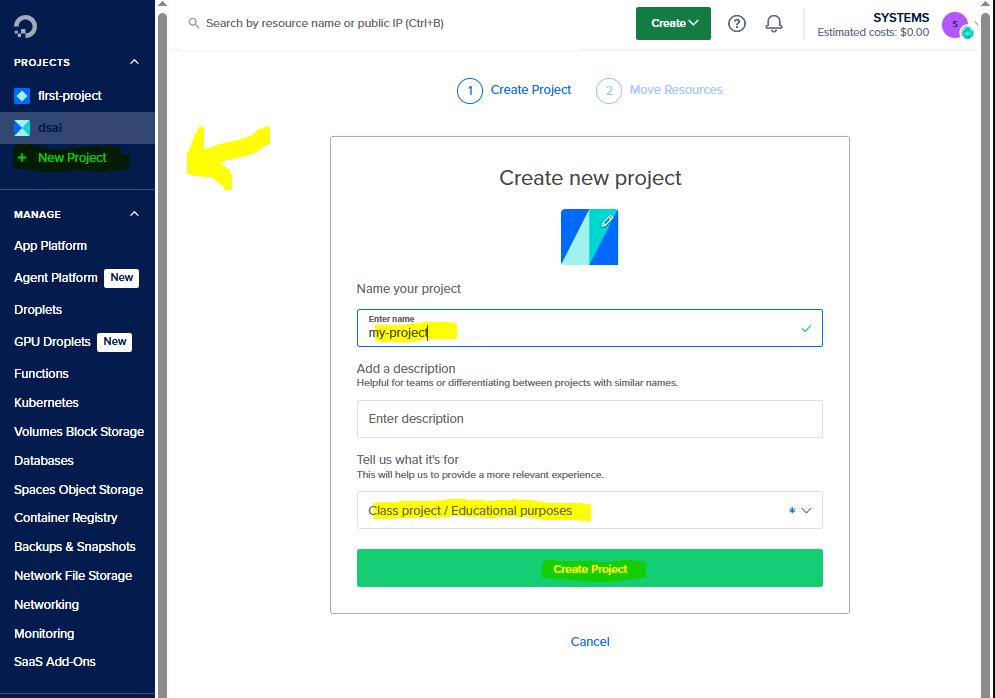

# 📌 ACTIVITY

## Setup DigitalOcean Account

🕒 *Estimated Time: 5–10 minutes*

---

## ✅ Your Task: Set Up DigitalOcean

Follow the steps below to get your **DigitalOcean** account ready for use in this hackathon.

### 🧱 Stage 1: Sign Up for [DigitalOcean](https://www.digitalocean.com/)

- [ ] Go to the 🔗 [DigitalOcean Signup](https://cloud.digitalocean.com/registrations/new) page.
- [ ] Click "Sign Up with **GitHub**" OR "Signup with **Google**" and create a **DigitalOcean** account. You will eventually link your **GitHub** account either way.

- [ ] Upon signing in, you will be brought to your **Control Panel** for your default project. *(You can later make more 'projects'.)* **Bookmark this page to return to.**

### 🧱 Stage 2: Add Billing Information

To deploy any **DigitalOcean** cloud infrastructure, you will need to add billing information to your account/team.

- [ ] Select your Profile Picture in the upper right corner, and click **My Account**.
- [ ] Navigate to the **Your Teams** panel.
- [ ] Find your team. *(E.g., I named mine SYSTEMS.)*
- [ ] Click the ellipsis `...`.
- [ ] Select **Manage Billing**.

- [ ] On the **Billing** page, navigate to **Payment Methods** and select **[Add Payment Method]**.

- [ ] Select your preferred method of payment. As of the time of writing, you can use **Credit Card**, **Alipay**, **Google Pay**, or **PayPal**.

### 🧱 Stage 3: Create your Project

Finally, all cloud infrastructure you make will be grouped by **projects**. I encourage you to make just **one project**.

- [ ] **Create a new project**, giving a **clear name** with hyphens. Select 'Class project/Educational purposes' under **Tell us what it's for**. Then click Create Project!

### 🧱 Stage 4: Choose What to Deploy

After account setup, decide which demo app type you want to deploy first:

- [ ] API in Python: [`../fastapi/`](../fastapi/)
- [ ] API in R: [`../plumber/`](../plumber/)
- [ ] App in Python: [`../shinypy/`](../shinypy/)
- [ ] App in R: [`../shinyr/`](../shinyr/)
- [ ] Optional DB workflow: [`../supabase/`](../supabase/)
- [ ] GitHub setup support: [`../github/`](../github/)

---

---

← 🏠 [Back to Top](#ACTIVITY)