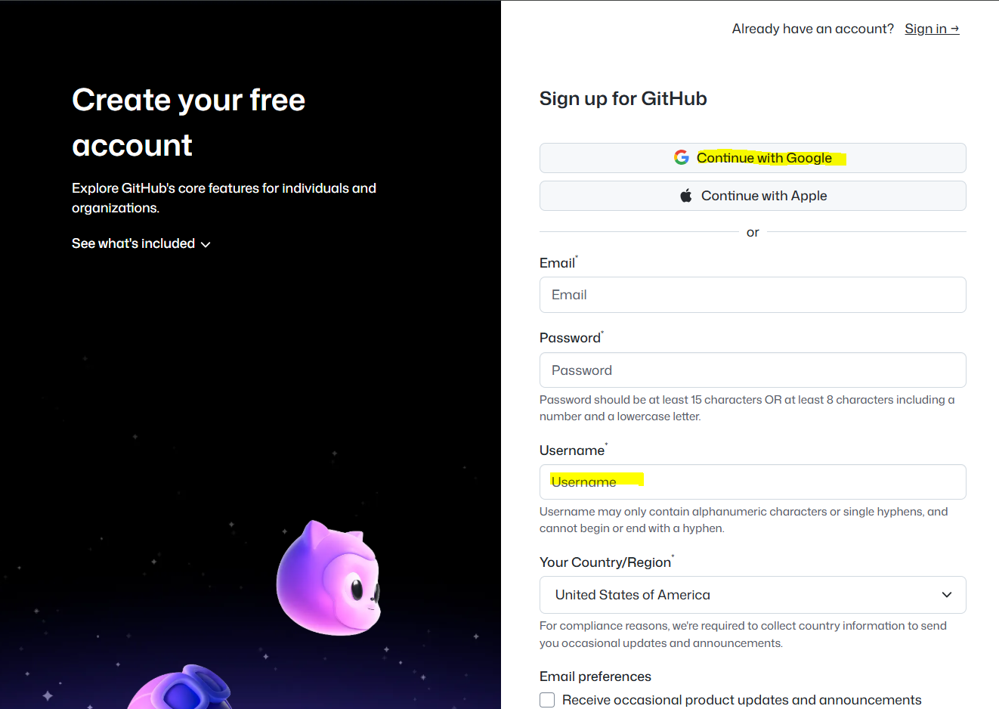
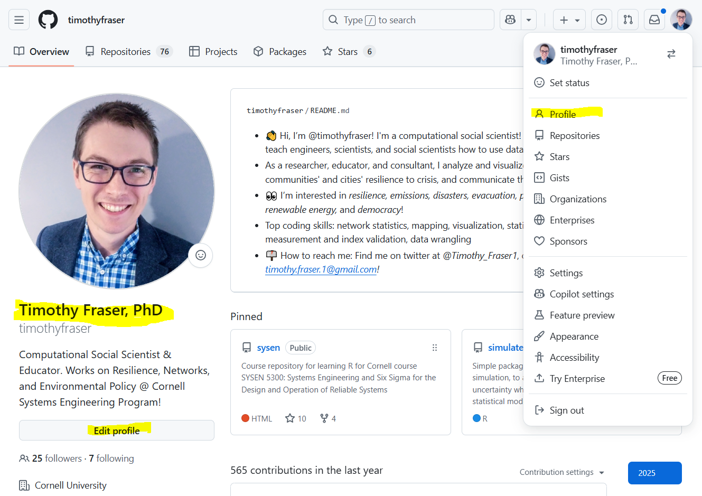

# 📌 ACTIVITY

## Setup GitHub Account

🕒 *Estimated Time: 5–10 minutes*

---

## ✅ Your Task

Follow the steps below to get your GitHub account ready for use in the AI Systems Hackathon.

### 🧱 Stage 1: Sign Up for GitHub

- [ ] Go to the 🔗 [Github Signup](https://github.com/signup) page.
- [ ] Check that you went to **`github.com`**, not a company-specific GitHub Enterprise URL.
- [ ] Click "Sign Up" and create a GitHub account.
- [ ] Choose a professional username — ideally your real name or something recognizable.
(Example: My GitHub ID is github.com/timothyfraser)

### 🧱 Stage 2: Customize Your Profile

- [ ] Go to your GitHub profile page: `github.com/<your_github_id>`.
- [ ] Customize your profile so teammates and mentors can find you.
    - [ ] Click **Edit Profile** to customize your display name and profile picture.
    - [ ] Set your name to your professional name. For example, mine is **Timothy Fraser, PhD.**
    - [ ] Set your profile picture to something recognizable (professional headshot or another clear image).
    

---

← 🏠 [Back to Top](#ACTIVITY)
