# 📌 ACTIVITY

## Deploy to Posit Connect via GitHub Actions

🕒 *Estimated Time: 10-15 minutes*

---

## ✅ Your Task

Set up GitHub Actions to deploy your app/API to Posit Connect.

### 🧱 Stage 1: Generate `manifest.json`

Run the manifest helper in the app folder you want to deploy:

- Shiny R: [`../shinyr/manifestme.R`](../shinyr/manifestme.R)
- Plumber: [`../plumber/manifestme.R`](../plumber/manifestme.R)
- Shiny Python: [`../shinypy/manifestme.sh`](../shinypy/manifestme.sh)
- FastAPI: [`../fastapi/manifestme.sh`](../fastapi/manifestme.sh)

Example screenshots:

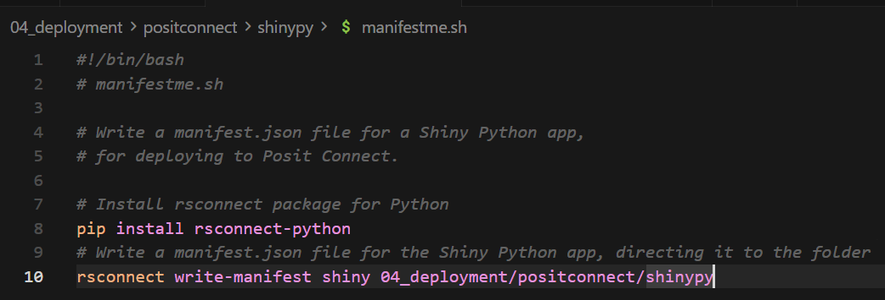
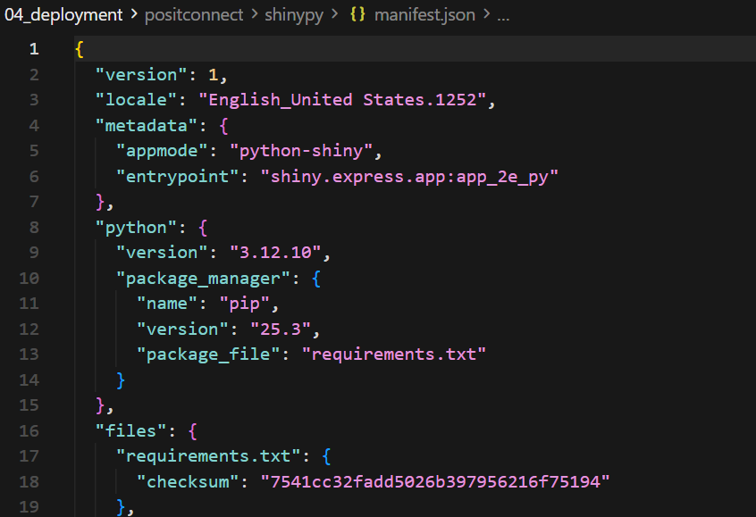

---

### 🧱 Stage 2: Create Posit Connect API Key

- [ ] In Posit Connect, open your account settings and create a **Publisher** API key.
- [ ] Copy and store the API key safely.

Reference screenshots:

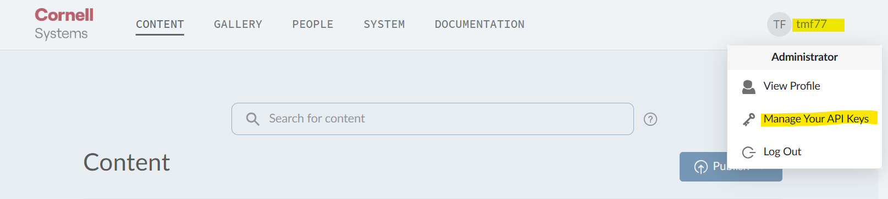
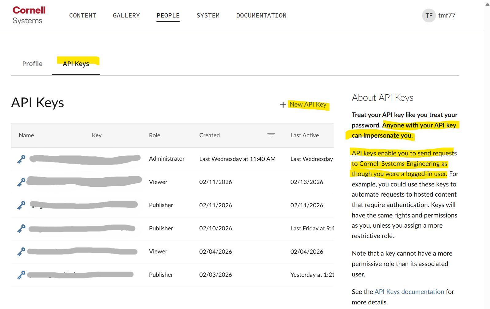
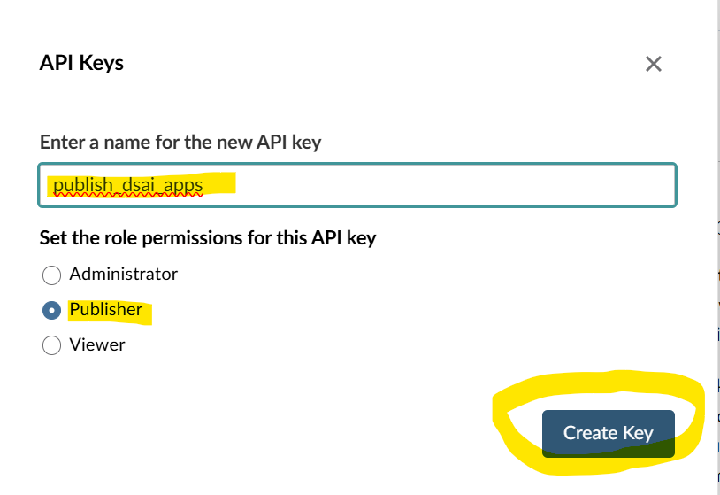
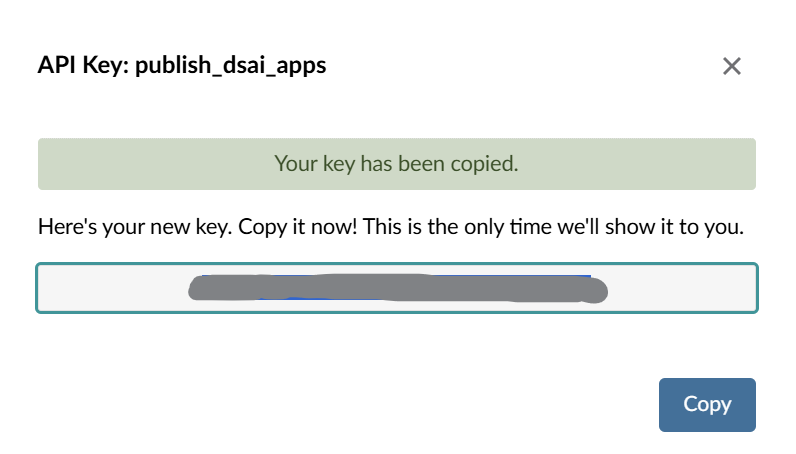

---

### 🧱 Stage 3: Configure GitHub Secrets

In your GitHub repository, add:

- [ ] `CONNECT_SERVER` (your Posit Connect server URL)
- [ ] `CONNECT_API_KEY` (publisher API key)

Reference screenshots:

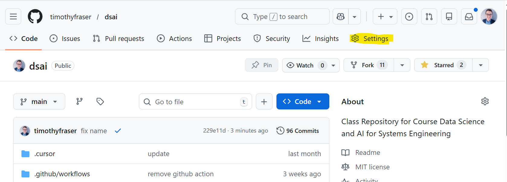
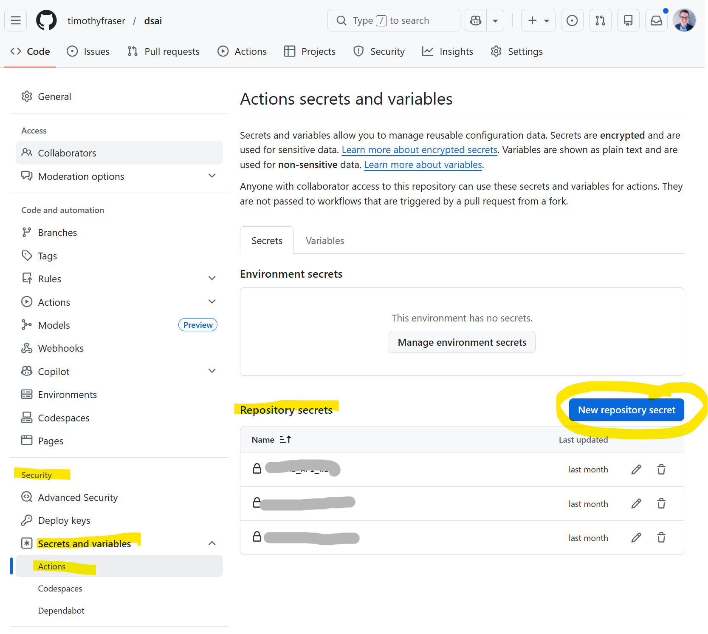
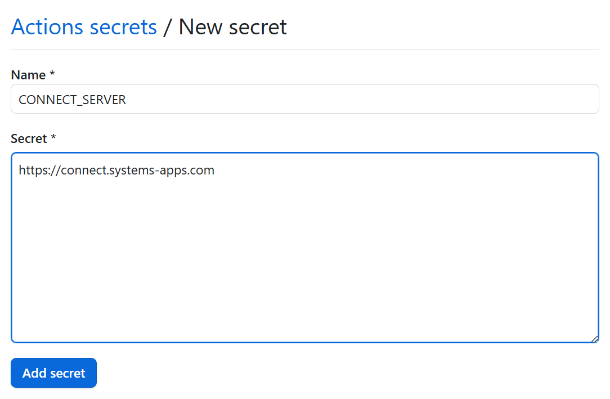
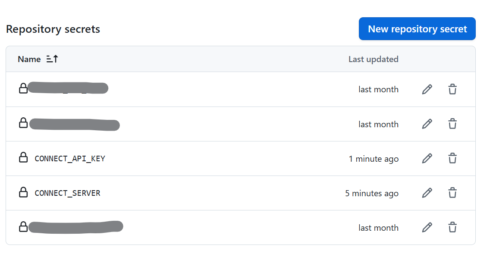

---

### 🧱 Stage 4: Add Workflow Template

Use templates in this folder:

- Shiny R: [`workflows/deploy-shinyr.yml`](workflows/deploy-shinyr.yml)
- Shiny Python: [`workflows/deploy-shinypy.yml`](workflows/deploy-shinypy.yml)
- Plumber: [`workflows/deploy-plumber.yml`](workflows/deploy-plumber.yml)

FastAPI can be deployed directly via:

- [`../fastapi/deployme.sh`](../fastapi/deployme.sh)

After copying a template into your repo’s `.github/workflows/`, update `paths` and `dir` so they match your project structure.

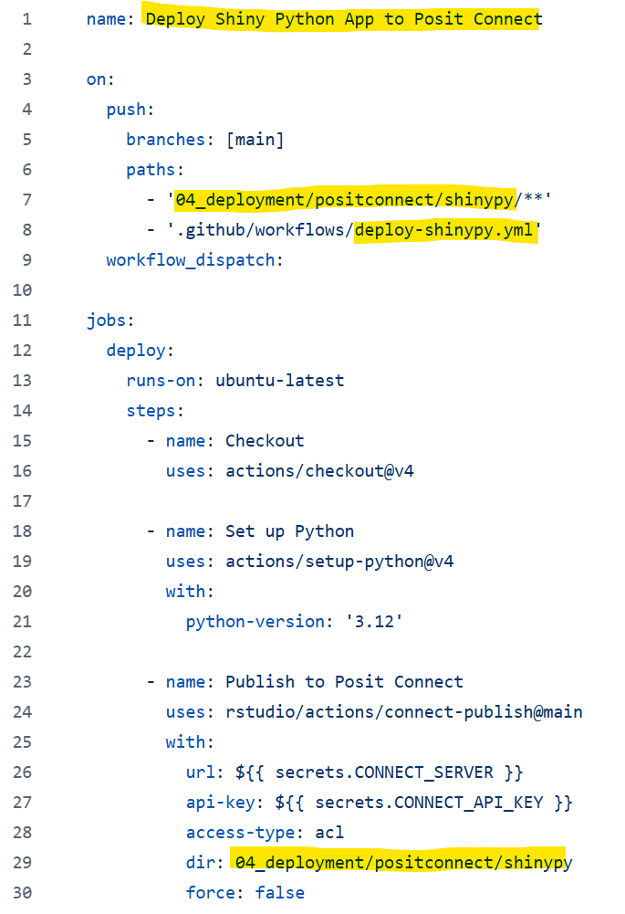

---

### 🧱 Stage 5: Test Deployment

- [ ] Push to `main` or run workflow manually in GitHub Actions.
- [ ] Confirm successful run in Actions tab.
- [ ] Open your Posit Connect dashboard and verify the app/API is deployed.

Reference screenshots:

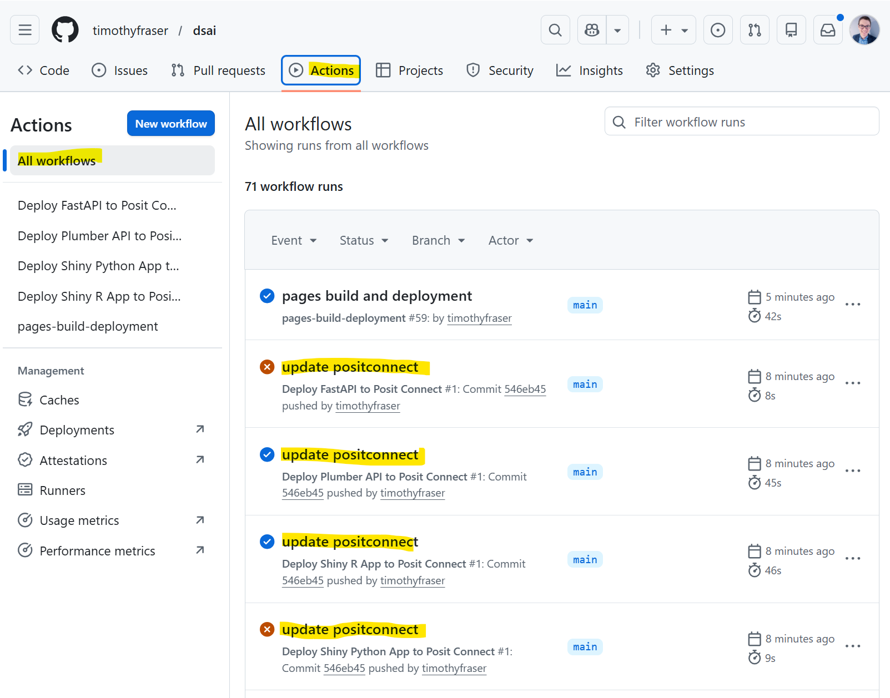
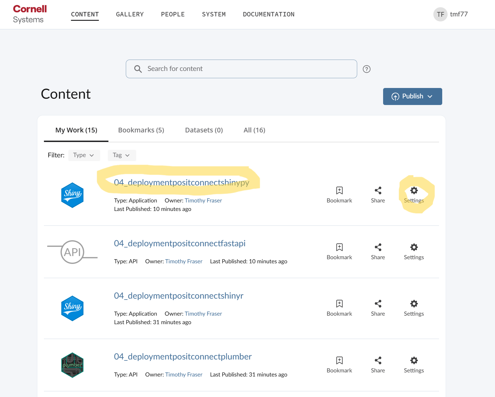
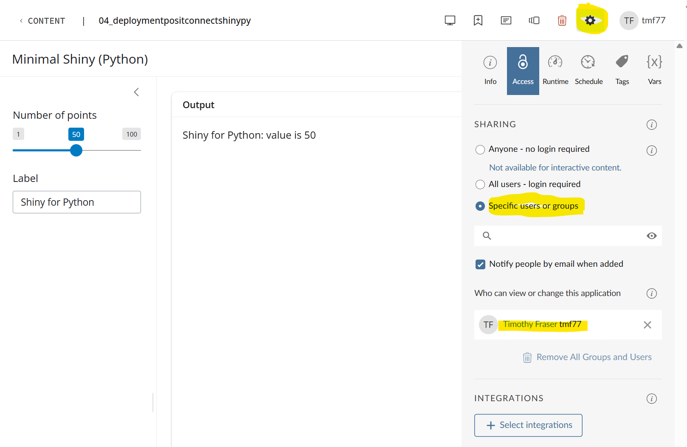
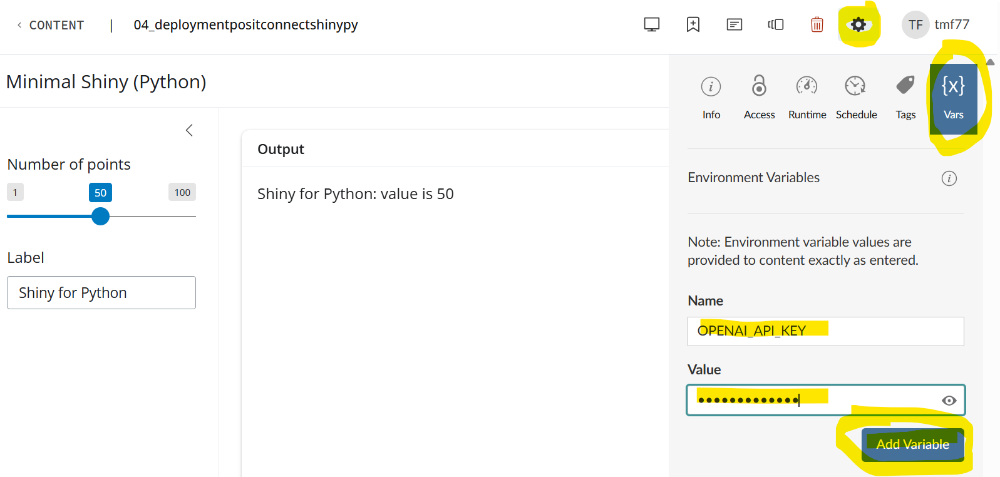
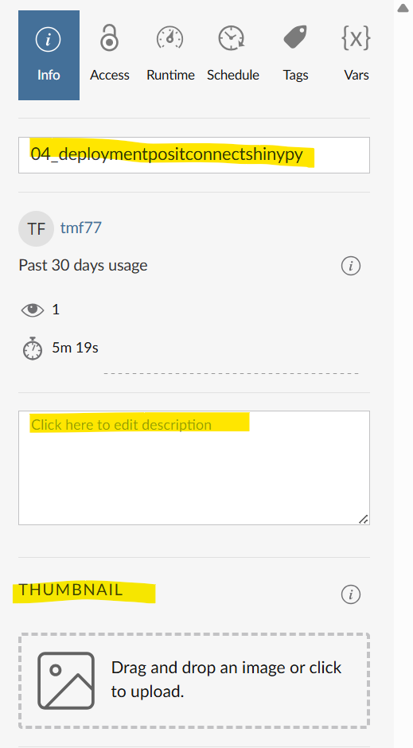

---

## Related Demo Folders

- [`../github/`](../github/)
- [`../fastapi/`](../fastapi/)
- [`../plumber/`](../plumber/)
- [`../shinypy/`](../shinypy/)
- [`../shinyr/`](../shinyr/)
- [`../supabase/`](../supabase/)

---

---

← 🏠 [Back to Top](#ACTIVITY)
